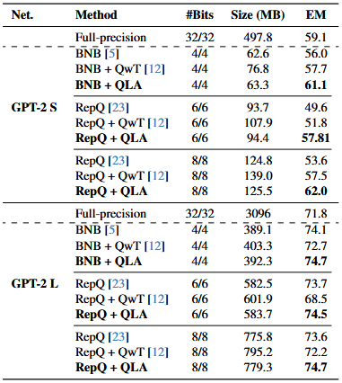
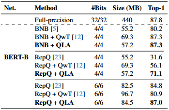

# Generative Models

Refer to the following instructions to reproduce the results of QLA.

## Encoder Based Models
The code snippet below details how to run experiments on BERT and RoBERTa models. While the below code uses ```bert.py``` as an example, the same arguments apply to ```roberta.py```

```bash
python bert.py

# General Arguments
--model: Refer to bert.py and roberta.py for model zoo
--w_bits: Weight bits
--a_bits: Activation bits
--embed_bits: Embedding layer bits

# QLA Arguments
--attn_r: Intermediate dimension between pointwise pointwise convolutions
--mlp_r: Intermediate dimension between LoRA layers
--mlp_kind: Type of FFN compensation layer ("affine", "lowrank", "bottleneck")

Refer to bert.py or roberta.py for other miscilanous arguments
```

## Decoder based Models
The code below provides details on how to run experiments on GPT-2.

```bash
python gpt2_repq.py

# General Arguments
--model: Refer to resnet.py for model zoo
--w_bits: Weight bits
--a_bits: Activation bits

# QLA Arguments
--attn_r: Intermediate dimension between pointwise pointwise convolutions
--mlp_r: Intermediate dimension between LoRA layers
--mlp_kind: Type of FFN compensation layer ("affine", "lowrank", "bottleneck")

Refer to gpt2_repq.py for other miscilanous arguments
```

## Results

Below are the results obtained on the SQuAD v1.1 and MRPC datasets for various language models.

<p align="center"><em>
Performance of GPT-2 (Small & Large) models on the
SQuAD v1.1 dataset under different quantization settings. We
report model size and Exact Match (EM) scores for BNB, RepQ,
QwT, and the proposed method across multiple bit-widths.
</em></p>
<p align="center">
    
</p>

<p align="center"><em>
Performance of BERT Base on MRPC
</em></p>
<p align="center">
    
</p>


<p align="center"><em>
 Performance of RoBERTa on the SQuAD v1.1 dataset
</em></p>
<p align="center">
    
</p>
