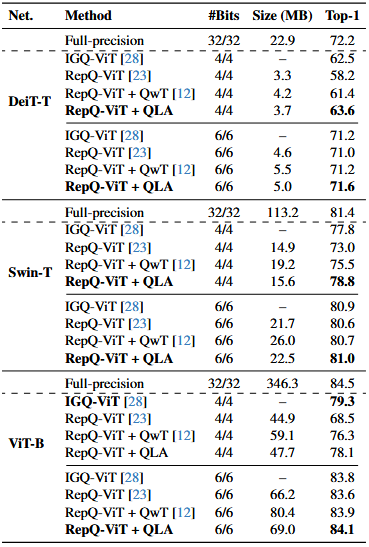
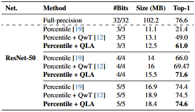

# Vision Transformers

Refer to the following instructions to reproduce the results of QLA.

## Transformer Based Models

The code snippet below details how to run experiments on ViT, DeiT, and Swin models. While the below code uses ```vit_and_deit.py``` as an example, the same arguments apply to ```swin.py```

```bash
python vit_and_deit.py

# General Arguments
--model: Refer to vit_and_deit.py and swin.py for model zoo
--w_bits: Weight bits
--a_bits: Activation bits

# QLA Arguments
--attn_r: Intermediate dimension between pointwise pointwise convolutions
--mlp_r: Intermediate dimension between LoRA layers
--mlp_kind: Type of FFN compensation layer ("affine", "lowrank", "bottleneck")
--blocks: Blocks which QLA compensation should be added to, e.g. 7 8 9 10
--epochs: Number of epochs to train QLA adapters

Refer to vit_and_deit.py or swin.py for other miscilanous arguments
```

## CNNs
The code below provides details on how to run experiments on ResNet.

```bash
python resnet.py

# General Arguments
--model: Refer to resnet.py for model zoo
--w_bits: Weight bits
--a_bits: Activation bits

# QLA Arguments
--kernel_size: Adapter kernel size \(1 or 3)
--factor: Adapter grouping: groups = cin // factor
--adapter_epochs: Number of epochs to train QLA adapters

Refer to resnet.py for other miscilanous arguments
```

### Pretrained Weights

Differing from other models, weights for ResNet 50 must be download manually and placed within the ```pretrained_weights``` directory. As no links are allowed during CVPR submission, this must be excluded for now.
<!-- 
| Backbone | Pretrain | Source | Weights |
| :---: | :---: | :---: | :---: |
| ResNet50 | ImageNet-1K         |  | [ckpt] |
 -->

## Results

Below are the results obtained on the ImageNet-1K dataset for various vision models. It should be noted that these results are from utilizing a 40,000 image subset of the full training set.

<p align="center"><em>
Table 1 — Comparison of quantization methods on different
transformer-based models. Due to the unavailability of their im-
plementation, results for IGQ-ViT were sourced directly from their
paper. Results for QwT were obtained by running their provided
implementation on GitHub.
</em></p>
<p align="center">
    
</p>

<p align="center"><em>
Table 2 — Comparison of quantization methods on ResNet-50.
</em></p>
<p align="center">
    
</p>

<!-- | Model                    | Method         | Prec. | Top-1(%) | Prec. | Top-1(%) |
|:--------------:          |:-------------: |:-----:|:--------:|:-----:|:--------:|
| DeiT-T (72.2)            |  RepQ-ViT      | W4/A4 |  58.2    | W6/A6 |  71.0   |
|                          | RepQ-ViT + QLA | W4/A4 |  63.6    | W6/A6 |  71.6   |
| Swin-T (81.4)            |  RepQ-ViT      | W4/A4 | 73.0     | W6/A6 | 80.6    |
|                          | RepQ-ViT + QLA | W4/A4 | 78.8     | W6/A6 | 81.0    |
| ViT-B (84.5)             |  RepQ-ViT      | W4/A4 |  68.5    | W6/A6 |  83.6   |
|                          | RepQ-ViT + QLA | W4/A4 |  78.1    | W6/A6 |  84.1   |

### CNN Results
| Model                    | Method         | Prec. | Top-1(%) | Prec. | Top-1(%) |Prec. | Top-1(%) |
|:--------------:          |:-------------: |:-----:|:--------:|:-----:|:--------:|:-----:|:--------:|
| ResNet50 (76.6)          |  Percentile      | W3/A3 | 21.4   | W4/A4 | 66.0    | W5/A5 | 74.4    |
|                          | Percentile + QLA | W3/A3 | 61.0   | W4/A4 | 71.6    | W5/A5 | 74.6    | -->
